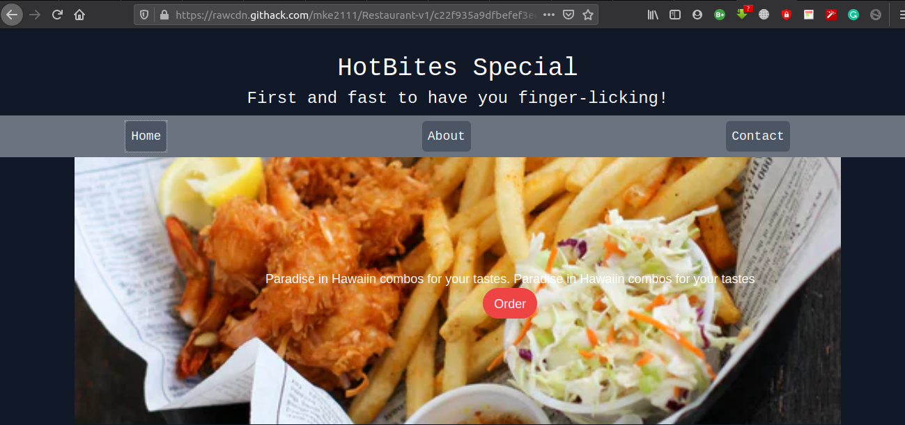

# Restaurant-v1

> This is a one page website that uses tabs for navigation. ES6 functionality is largely adopted and all modules are linked with import and export Javascript defaults.

## Built

- Javascript
- HTML 5
- TailwindCSS

## Live Demo

[Live Demo](https://rawcdn.githack.com/mke2111/Restaurant-v1/c22f935a9dfbefef3ee9cae925d8a7435f398d8f/dist/index.html)

## Getting Started

To get a local copy up and running follow these simple example steps.

### Prerequisites

- A browser
- Text Editor

### Setup

**STEP 1**
In the terminal, Run the following commands.

- `git clone https://github.com/mke2111/Restaurant-v1.git`
- `cd Library-JS`

OR

- Download the zip file form `https://github.com/mke2111/Restaurant-v1/tree/development`

**STEP 2**

- Then open the `index.html` file from the `dist` folder using a browser.
- Enjoy the simple restaurant website.

## Author

👤 **Roy Mukuye**

- GitHub: [@mke2111](https://github.com/mke2111)
- Twitter: [@Roymkenya](https://twitter.com/Roymkenya)
- LinkedIn: [Roy Mukuye](https://www.linkedin.com/in/roy-mukuye-42b07b1b4)

## 🤝 Contributing

Contributions, issues and feature requests are welcome!

Feel free to check the [issues page](https://github.com/mke2111/Restaurant-v1/issues).

## Show your support

Give a ⭐️ if you like this project!

## 📝 License

This project is [MIT](https://opensource.org/licenses/MIT) licensed.
